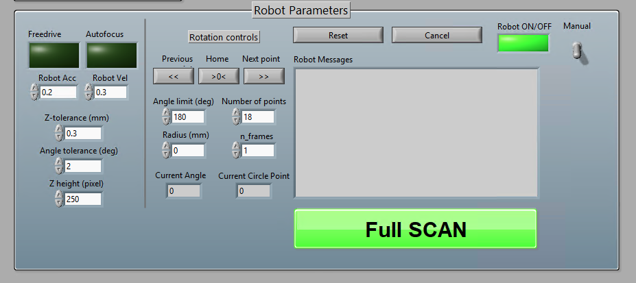
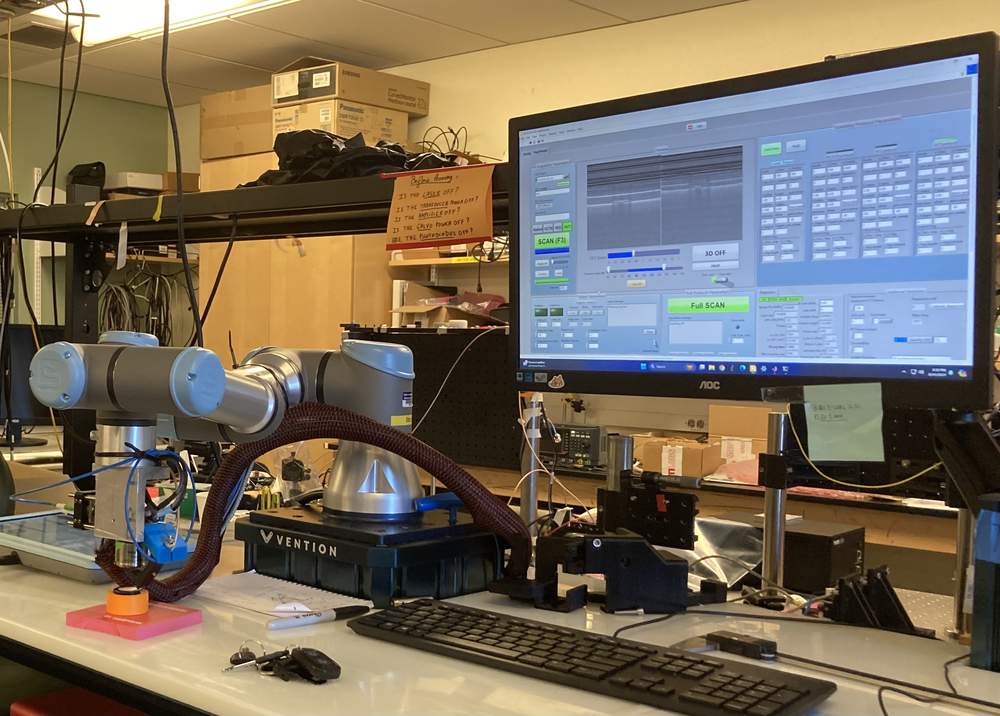

# Polarization Sensitive Optical Coherence Tomography Angiography (PS-OCTA) and Optical Coherence Elastography (OCE) Robot Platform. 

[](https://docs.ros.org/en/jazzy/index.html)
[](https://www.ni.com/en/shop/labview.html)
[](LICENSE)

| Component | Tested Version | Notes |
|-----------|---------------|-------|
| [ROS 2](https://docs.ros.org/en/jazzy/index.html) | **Jazzy** | Native install or inside the provided Docker image |
| [LabVIEW](https://www.ni.com/en/shop/labview.html) | **2024 Q1** (64-bit) | Required for acquisition & real-time display |
| [RTI DDS Toolkit](https://www.rti.com/products/tools/dds-toolkit-labview) | **3.2.0.114** | Install into LabVIEW before first run |
| [Open3D](https://www.open3d.org) | **0.19** | libopen3d-dev |
| [OpenCV](https://www.opencv.org) | **4.6.0** | libopencv-dev |
| [Eigen](https://eigen.tuxfamily.org) | **3.4** | Included with ROS2 by default or libeigen3-dev  |
| [Docker](https://www.docker.com) | **28.2.2** (optional) | Reproducible container build |

---

## Table of Contents
1. [Quick start](#quick-start)  
2. [Design](#design)  
3. [Usage examples](#usage-examples)  
4. [Hardware](#hardware)
5. [Citing](#citing) 
6. [Funding](#funding)  

---

## Quick start

> All dependencies—except LabVIEW—are already baked into the Docker image.

### Docker Image (recommended)
```bash
cd docker/
docker compose up -d
```

### Native build
```bash
sudo apt update && rosdep update
rosdep install --from-paths src --ignore-src -r -y
colcon build --symlink-install
source install/setup.bash
```

#### Launch helper
```bash
./launch.sh -h
Launch octa/oce ROS program

Syntax: [-s|-d|-h]
options:
h     Print this Help.
s     Simulation
d     Debug
```

## Design
### Overview
```
    ┌────────────────────┐
    │ OCTA-OCE Equipment │
    └────────────────────┘
               │
               │ Control & Data
               ▼
 ┌──────────────────┐   DDS/RTPS   ┌──────────────────┐
 │  LabVIEW RT VI   │◄────────────►│   ROS 2 Jazzy    │
 │ (Acquisition &   │              │  (Control layer) │
 │  Live display)   │              └────────┬─────────┘
 └──────────────────┘                       │ ros2_control
                                            ▼
                                    ┌──────────────────┐
                                    │   UR3e Robot     │
                                    │  (RTDE bridge)   │
                                    └──────────────────┘
```
- Notes: Preview images and button control is sent over the RTI DDS layer. Control of the robot is done using Moveit and ROS2 UR drivers.

### Directory layout
```
|-- action/    # action definitions
|-- src/       # source files
|-- docker/    # docker container quick start
|-- VI/        # LabVIEW files
|   |-- Robot/     # Labview message definitions and robot VI files
|   |   |-- rti/   # Generated VI subscriber/publisher
|-- msg/       # dds message definitions
|-- bags/      # bags captured from real system for testing
|-- cad/       # cad files for end effector
|-- srv/       # service files definitions
|-- utils/
|   |-- start_ursim.sh  # Simulate UR3e robot
|   |-- setup.sh        # Dependencies for manual install
|   |-- record.sh       # Recording ROS bags
|   |-- ur_driver.sh    # ROS2 UR robot driver
|   |-- ur_moveit.sh    # Moveit driver
|-- config/    # configuration files
|-- srdf/      # srdf definitions
|-- urdf/      # end effector definitions
```

### ROS2 Design


- `coordinator_node`: handles DDS messages and action server jobs
- `focus_node`: handles image capture and auto-focusing of end effector to desired position.
- `reset_node`: moves robot to default position and captures preview background
- `move_z_angle_node`: rotates the robot end effector in the z-axis of the robot's TCP
- `freedrive_node`: switch robot controller to `freedrive_mode_controller` and back to `scaled_joint_trajectory_controller`
- `reconnect_client`: resets the robot status to ready mode 
- `joint_state_publisher`: echoes an binary integer that flips if there is velocity in the joints - freezes preview on robot movement.

## Usage examples

[](https://github.com/user-attachments/assets/f6faee66-33a7-49da-ba42-7a2a0e900b7e)

### Controlling from LabVIEW



### Hardware Run

```bash
./launch.sh -d # debug mode
bash utils/record.sh bag1 # for recording data
```

### Simulation Run
```bash
bash utils/start_ursim.sh # start UR robot simulator container
./launch.sh -sd # debug mode
```

### Testing

```bash
bash utils/ur_driver.sh
bash utils/ur_moveit.sh
```

## Citing

```bibtex
@software{ps-octa-oce-robot,
  title        = {Polarization-Sensitive OCT Angiography and Optical Coherence Elastography Robot Platform},
  year         = {2025},
  publisher    = {GitHub},
  howpublished = {\url{https://github.com/rjbaw/PS-OCTA-OCE-Robot}},
}
```

## Hardware


## Funding

This work was supported by the National Institutes of Health under grant [R01AR077560-01A1](https://reporter.nih.gov/project-details/10204507) – “Dynamic OCE with acoustic micro-tapping for in-vivo monitoring of skin-graft surgeries”, University of Washington, PI Ivan Pelivanov.
