# Polarization Sensitive Optical Coherence Tomography Angiography (PS-OCTA) and Optical Coherence Elastography (OCE) Robot Platform. 

[](https://rjbaw.github.io/PS-OCTA-OCE-Robot/)
[](https://docs.ros.org/en/jazzy/index.html)
[](https://www.ni.com/en/shop/labview.html)
[](LICENSE)

| Component | Tested Version | Notes |
|-----------|---------------|-------|
| [ROS 2](https://docs.ros.org/en/jazzy/index.html) | **Jazzy** | Native install or inside the provided Docker image |
| [LabVIEW](https://www.ni.com/en/shop/labview.html) | **2024 Q3** (64-bit) | Required for acquisition & real-time display |
| [RTI DDS Toolkit](https://www.rti.com/products/tools/dds-toolkit-labview) | **4.0.0.114** | Install into LabVIEW before first run |
| [Open3D](https://www.open3d.org) | **0.19** | libopen3d-dev |
| [OpenCV](https://www.opencv.org) | **4.6.0** | libopencv-dev |
| [Eigen](https://eigen.tuxfamily.org) | **3.4** | Included with ROS2 by default or libeigen3-dev  |
| [Onnxruntime](https://onnxruntime.ai) | **1.22.2** | Built from source inside docker  |
| [OpenVINO](https://openvino.ai) | **2025.3.0** | Optional for Intel GPU/NPU (Deployment PC has Intel GPU & NPU)  |
| [Docker](https://www.docker.com) | **28.2.2** (optional) | Reproducible container build |

---

## Table of Contents
1. [Quick start](#quick-start)
2. [Operations (Make)](#operations-make)
3. [Troubleshooting](#troubleshooting)
4. [Design](#design)
5. [Usage examples](#usage-examples)
6. [Hardware](#hardware)
7. [Citing](#citing)
8. [Funding](#funding)

---

## Quick start
> All dependencies—except LabVIEW—are already baked into the Docker image.

Please install [Git LFS](https://git-lfs.com) or just grab the model from the releases and place them inside the config folder.

### Docker Image (recommended)

```bash
# Export host/robot IP address or just use defaults
export ROBOT_IP=${ROBOT_IP}
export HOST_IP=${HOST_IP}

# Hardware run
make run

# Dev container
make dev
```

### Operations (Make)
Run `make help` anytime to see available commands.

```bash
# Start/stop the container
make run
make down

# Use a specific robot IP for this run
ROBOT_IP=192.168.0.10 make run

# Show status (container, tmux session, robot reachability)
make status

# Show logs
# - if a crash log exists: print last 300 lines
# - otherwise: capture last 300 lines live from tmux
make logs

# Attach to the ROS tmux session inside the container
make attach

# Open a shell in the container
make shell

# Restart the container
make restart

# Prune logs older than 7 days (override with PRUNE_LOGS_DAYS=14)
make prune-logs
```

## Troubleshooting

- Container not running
  - `make run`
  - `make status` shows container state; `make restart` if needed.

- Cannot attach to tmux
  - `make attach`
  - If it says “no session”, check `make status` and ensure the container is running and ROS has been started by the monitor.

- No logs printed
  - `make logs` prints the last 300 lines. If there’s no crash log yet, it captures live tmux output.
  - RCUTILS logs are under `./logs/<timestamped_dir>` when enabled; prune with `make prune-logs`.

- Robot unreachable
  - Verify IP: `echo $ROBOT_IP` then `ping -c1 $ROBOT_IP`.
  - Start with a larger timeout: `PING_TIMEOUT=1 CHECK_INTERVAL=1 ROBOT_IP=... make run`.
  - Avoid ARP flushing; it’s disabled by design to prevent flapping.

- LabVIEW run_state not detected
  - Increase wait: `RUN_STATE_TIMEOUT=1s make run`.
  - Validate publisher is active in LabVIEW.

- X11 display issues (RViz, GUIs)
  - On host: `xhost +local:` (temporary) and ensure `DISPLAY`/`.Xauthority` are correct.

- Logs growing too large
  - Auto-prune keeps entries older than 7 days cleaned at startup.
  - Manual cleanup: `make prune-logs` or set `PRUNE_LOGS_DAYS=3 make prune-logs`.

Environment knobs
- `ROBOT_IP`, `HOST_IP` — network endpoints
- `PING_TIMEOUT`, `CHECK_INTERVAL` — connectivity checks (seconds)
- `RUN_STATE_TIMEOUT` — wait for `/run_state` sample (e.g., `1s`)
- `LOG_DIR` — logs directory (default `./logs`)
- `PRUNE_LOGS_DAYS` — days before deletion (default 7)
- `RCUTILS_LOGGING_DIRECTORY` — enable ROS logs under `LOG_DIR`

#### Using URSim

```bash
bash utils/start_ursim.sh
ROBOT_IP=192.168.56.101 make run
```


### Native build
```bash
sudo apt update && rosdep update
bash utils/setup.sh
rosdep install --from-paths src --ignore-src -r -y
make build
source install/setup.bash
```

#### Launch helper
```bash
./launch.sh -h
Launch octa/oce ROS program

Syntax: [-s|-d|-h]
options:
h     Print this Help.
s     Simulation
d     Debug
```

## Design
### Overview
```
    ┌────────────────────┐
    │ OCTA-OCE Equipment │
    └────────────────────┘
               │
               │ Control & Data
               ▼
 ┌──────────────────┐   DDS/RTPS   ┌──────────────────┐
 │  LabVIEW RT VI   │◄────────────►│   ROS 2 Jazzy    │
 │ (Acquisition &   │              │  (Control layer) │
 │  Live display)   │              └────────┬─────────┘
 └──────────────────┘                       │ ros2_control
                                            ▼
                                    ┌──────────────────┐
                                    │   UR3e Robot     │
                                    │  (RTDE bridge)   │
                                    └──────────────────┘
```
- Notes: Preview images and button control is sent over the RTI DDS layer. Control of the robot is done using Moveit and ROS2 UR drivers.

[](https://github.com/user-attachments/assets/10f69ab5-a535-4c98-a0bc-1e19c28c5a8c)

### Directory layout
```
|-- action/    # action definitions
|-- src/       # source files
|-- docker/    # docker container quick start
|-- VI/        # LabVIEW files
|   |-- Robot/     # Labview message definitions and robot VI files
|   |   |-- rti/   # Generated VI subscriber/publisher
|-- msg/       # dds message definitions
|-- bags/      # bags captured from real system for testing
|-- cad/       # cad files for end effector
|-- srv/       # service files definitions
|-- utils/
|   |-- start_ursim.sh  # Simulate UR3e robot
|   |-- setup.sh        # Dependencies for manual install
|   |-- record.sh       # Recording ROS bags
|   |-- ur_driver.sh    # ROS2 UR robot driver
|   |-- ur_moveit.sh    # Moveit driver
|-- config/    # configuration files
|-- srdf/      # srdf definitions
|-- urdf/      # end effector definitions
```

### ROS2 Design
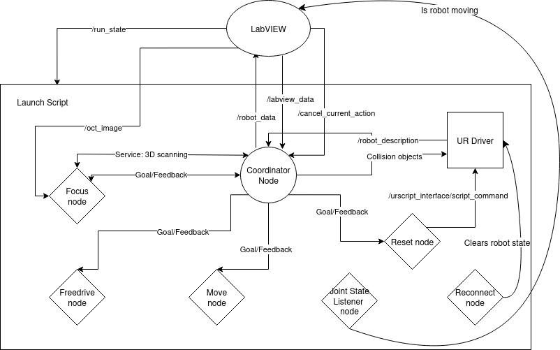

- `coordinator_node`: handles DDS messages and action server jobs
- `focus_node`: handles image capture and auto-focusing of end effector to desired position.
- `reset_node`: moves robot to default position and captures preview background
- `move_z_angle_node`: rotates the robot end effector in the z-axis of the robot's TCP
- `freedrive_node`: switch robot controller to `freedrive_mode_controller` and back to `scaled_joint_trajectory_controller`
- `reconnect_client`: resets the robot status to ready mode 
- `joint_state_publisher`: echoes an binary integer that flips if there is velocity in the joints - freezes preview on robot movement.

## Usage examples


[](https://github.com/user-attachments/assets/73df870e-d026-4eda-939c-03648ecc0e0d)

[](https://github.com/user-attachments/assets/411babd6-09d0-4099-885c-6c4ca57ff564)

[](https://github.com/user-attachments/assets/fba01416-4875-4cd9-9928-0afa79f6a66c)

### Controlling from LabVIEW

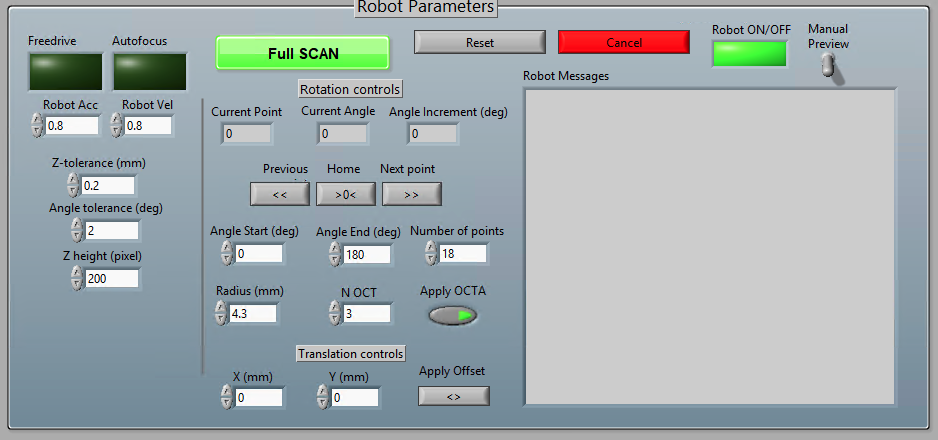

### Hardware Run

```bash
./launch.sh -d # debug mode
bash utils/record.sh bag1 # for recording data
```

### Simulation Run
```bash
bash utils/start_ursim.sh # start UR robot simulator container
./launch.sh -sd # debug mode
```

### Testing

```bash
bash utils/ur_driver.sh
bash utils/ur_moveit.sh
```

## Simulation

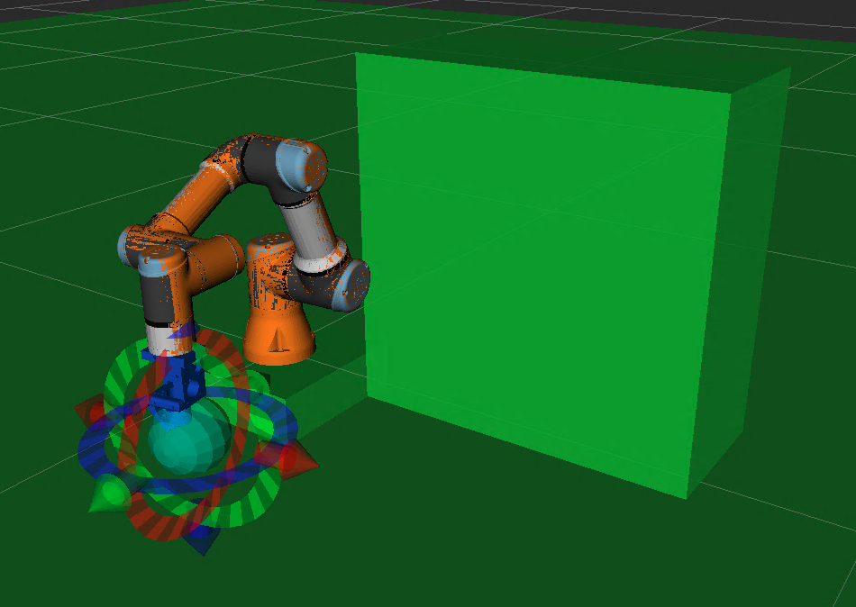

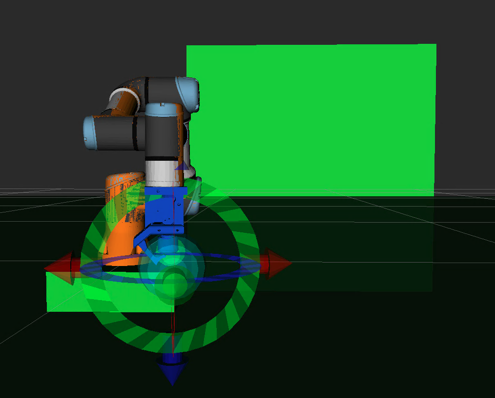

## Hardware
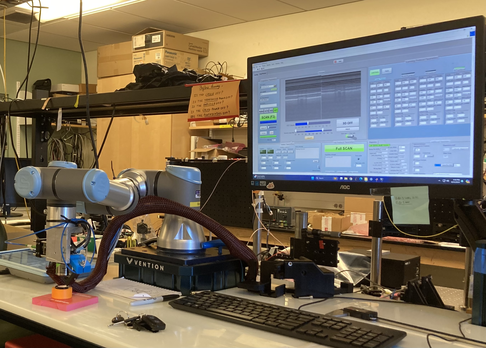


<table width="100%">
  <tr>
    <td align="center">UR Schematics</td>
    <td align="center">Physical Hardware Lens Center</td>
  </tr>
  <tr>
  <td width="50%">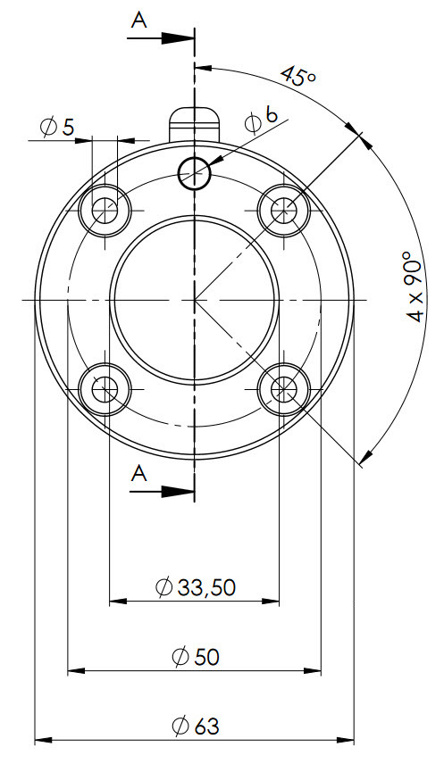</td>
  <td width="50%">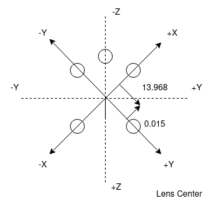</td>
  </tr>
</table>

<table width="100%">
  <tr>
    <td align="center">Default Position</td>
    <td align="center">Robot TCP</td>
  </tr>
  <tr>
  <td width="50%">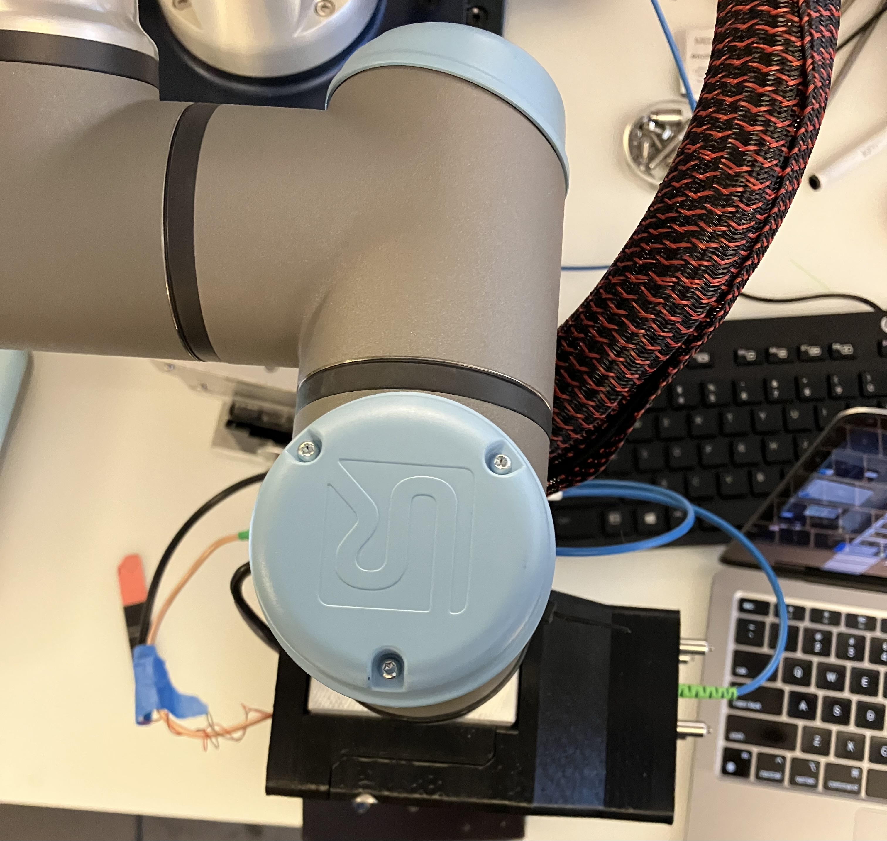</td>
  <td width="50%">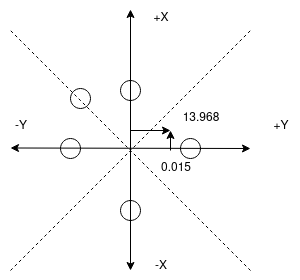</td>
  </tr>
</table>

### Robot TCP - OCT Calibration

#### Example
In this example, the slow axis is the inverse of the robot's X-axis and the fast axis is the same as the robot's Y-axis.

<table width="100%">
  <tr>
    <td align="center">OCT TCP (CR: Agathe Marmin)</td>
    <td align="center">Robot TCP</td>
  </tr>
  <tr>
  <td width="50%">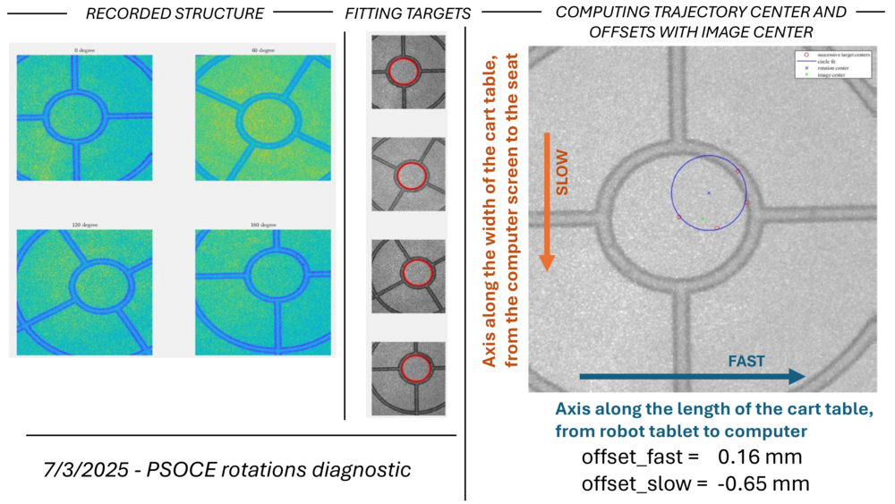</td>
  <td width="50%"></td>
  </tr>
</table>

To calibrate the robot's axis to align with the OCT axis, we need to subtract `0.00065`(0.65 mm) from x-axis and subtract `0.00016`(0.16 mm) from y-axis. We can do this in the urdf config located in `urdf/oct_tooling.xacro` in the joint named `oct-tcp`.

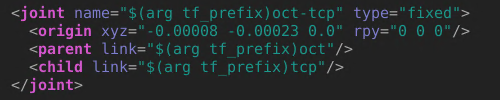

After making the changes recompile (`make build` or `make local`) then restart the robot program. Robot TCP is now calibrated.


## Citing

```bibtex
@software{ps-octa-oce-robot,
  title        = {Polarization-Sensitive OCT Angiography and Optical Coherence Elastography Robot Platform},
  year         = {2025},
  publisher    = {GitHub},
  howpublished = {\url{https://github.com/rjbaw/PS-OCTA-OCE-Robot}},
}
```

## Funding

This work was supported by the National Institutes of Health under grant [R01AR077560-01A1](https://reporter.nih.gov/project-details/10204507) – “Dynamic OCE with acoustic micro-tapping for in-vivo monitoring of skin-graft surgeries”, University of Washington, PI Ivan Pelivanov.
