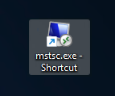
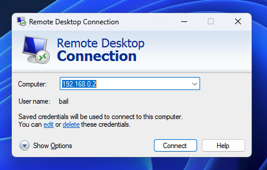
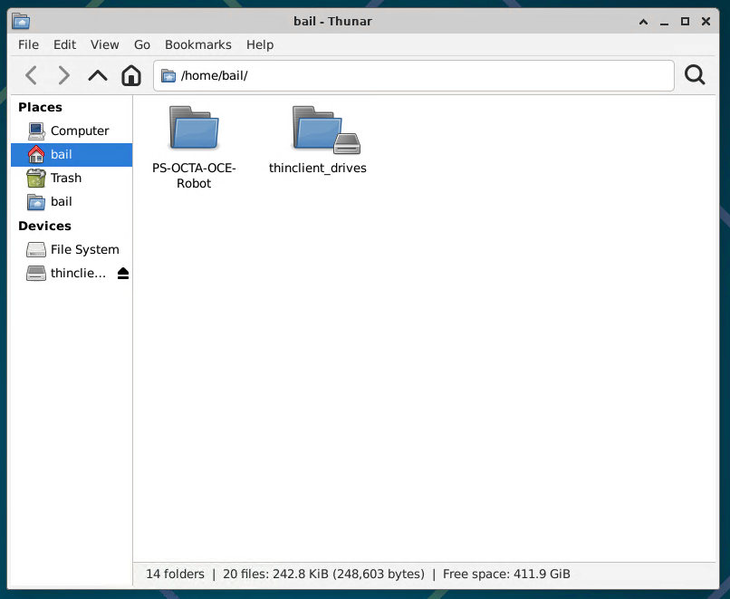
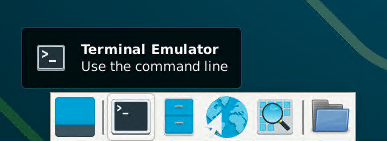
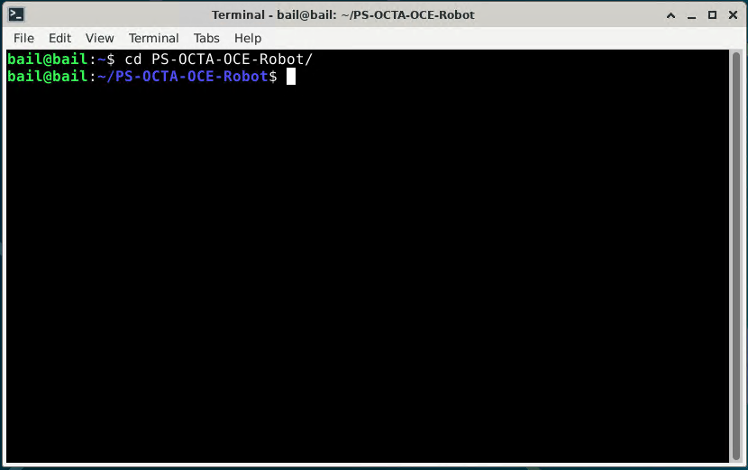
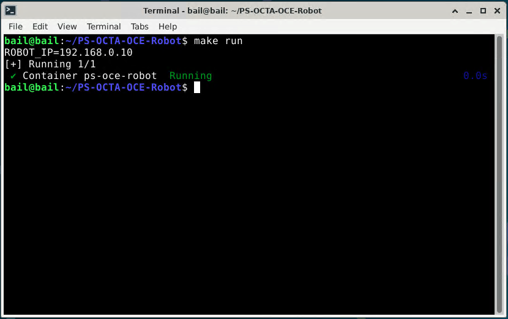
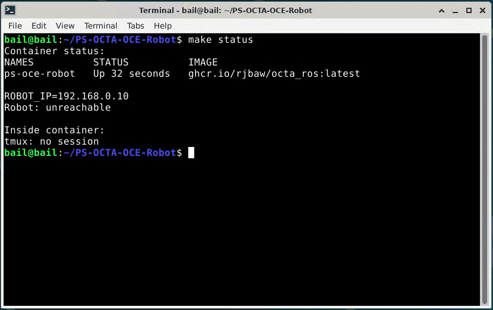

# +TITLE: PS-OCTA-OCE Robot Manual
# +AUTHOR: Raveeroj B.
#+LATEX_CLASS: article
#+LATEX_CLASS_OPTIONS: [a4paper]
#+LATEX_HEADER: \usepackage{mathrsfs}
#+LATEX_HEADER: \usepackage{xcolor}
#+LATEX_HEADER: \usepackage{microtype}
#+LATEX_HEADER: \usepackage{tikz-cd}
#+LATEX_HEADER: \usepackage{siunitx}
#+LATEX_HEADER: \usepackage{hyperref}
#+LATEX_HEADER: \usepackage[backend=biber]{biblatex}
#+LATEX_HEADER: \usepackage{amsmath}
#+LATEX_HEADER: \usepackage{amssymb}
#+LATEX_HEADER: \usepackage{amsfonts}
#+LATEX_HEADER: \usepackage{amsthm}
#+LATEX_HEADER: \usepackage{mathtools}
#+LATEX_HEADER: \usepackage{gensymb}
#+LATEX_HEADER: \usepackage{cancel}
#+LATEX_HEADER: \usepackage{unicode-math}
#+LATEX_HEADER: \usepackage{tcolorbox}
#+LATEX_HEADER: \usepackage{fontspec}
# +LATEX_HEADER: \setmainfont{CMU Serif}
#+LATEX_HEADER: \setmathfont{Latin Modern Math}
#+LATEX_HEADER: \setmathfont[range={\mathcal,\mathbfcal},StylisticSet=1]{XITS Math}
#+LATEX_HEADER: \setmathfont[range=\mathscr]{XITS Math}
#+LATEX_HEADER: \setmonofont{DejaVu Sans Mono}
#+LATEX_HEADER: \usemintedstyle{colorful} 
#+LATEX_HEADER: \setcounter{MaxMatrixCols}{20}
#+LATEX_HEADER: \usepackage{tikz}
#+LATEX_HEADER: \usepackage{pgfplots}
#+LATEX_HEADER: \usepackage{multicol}
#+LATEX_HEADER: \usepackage{fancyhdr}

#+LATEX_HEADER: \newtheorem*{sol}{Solution}
#+LATEX_HEADER: \newtheorem*{claim}{Claim}
#+LATEX_HEADER: \newtheorem{problem}{Problem}
#+LATEX_HEADER: \newtheorem{theorem}{Theorem}[section] 
#+LATEX_HEADER: \newtheorem{lemma}[theorem]{Lemma}
#+LATEX_HEADER: \newtheorem{proposition}[theorem]{Proposition}
#+LATEX_HEADER: \newtheorem{corollary}[theorem]{Corollary}

#+LATEX_HEADER: \usepackage[displaymath,textmath,floats,graphics,sections]{preview}
#+LATEX_HEADER: \PreviewEnvironment{tcolorbox}

#+LATEX_HEADER_EXTRA: \usepackage[margin=1in]{geometry}
#+LATEX_HEADER_EXTRA: \pagestyle{fancy}
#+LATEX_HEADER_EXTRA: \lhead{October 2, 2025}
#+LATEX_HEADER_EXTRA: \chead{PS-OCTA-OCE Robot Manual}
#+LATEX_HEADER_EXTRA: \rhead{Raveeroj B.}

#+PROPERTY: header-args :cache yes
#+OPTIONS: toc:nil date:nil
#+STARTUP: latexpreview
#+LATEX_COMPILER: lualatex

* Credentials

- =USER: bail=
- =PASS: uwamitudub=

* Remote Access

** Look for =mstsc.exe=

** Connect to =192.168.0.2=

** Project directory location

** Operating shell
Open up shell by clicking on the application icon for terminal emulator.

All make commands should be operated inside the project workspace. 

Images should be inside =result/= inside the project directory.
   
\pagebreak

* Operation
** Quick commands (Make)
#+ATTR_LATEX: :options frame=lines, linenos
#+begin_src bash
# Start/stop
make run
make down

# Status (container, manager, robot reachability)
make status

# Logs
make logs         # show last 300 lines (crash tail or RCUTILS)
make prune-logs   # delete logs older than 7 days (override: PRUNE_LOGS_DAYS=14)

# Interact
(manager mode) use make logs
make shell        # open a shell in the container

# Restart container
make restart
#+end_src

*** e.g. successful startup

** Make help
Run the following to list all available commands. See also README.md (Operations) for the same information and examples.
#+ATTR_LATEX: :options frame=lines, linenos
#+begin_src bash
make help
Make targets:
  build  - Build octa_ros (BUILD_TYPE=Debug)
  test   - Run tests for octa_ros and show results
  test-ci - Run tests excluding test_bag.py
  format - clang-format tracked C/C++ files; ruff on Python
  tidy   - Run clang-tidy on tracked C/C++ files
  lint   - Run 'tidy' and 'format'
  clean  - Remove build/install/log and compile_commands.json
  run    - Start deploy container
  dev    - Start dev container (mounts source, bash)
  dev-cpu - Start cpu dev container (mounts source, bash)
  local  - Build deployment image from local sources
  down   - Stop both dev and run containers
  logs   - Show last 300 lines (crash tail or RCUTILS)
  status - Show container, manager, and robot reachability
  shell  - Open an interactive shell in the container
  restart - Restart container (down then run)
  prune-logs - Delete logs older than PRUNE_LOGS_DAYS (default 7)
#+end_src

** SSH
#+ATTR_LATEX: :options frame=lines, linenos
#+begin_src bash
ssh bail@192.168.0.2
#+end_src

** Robot driver running status
#+ATTR_LATEX: :options frame=lines, linenos
#+begin_src bash
make status
#+end_src

*** Example of offline robot

** Entering the Docker container
#+ATTR_LATEX: :options frame=lines, linenos
#+begin_src bash
make shell
./launch.sh -d    # for debugging
#+end_src

#+ATTR_LATEX: :options frame=lines, linenos
#+begin_src bash
(manager mode) use make logs
#+end_src

** Code location
*** Project root (host)

#+ATTR_LATEX: :options frame=lines, linenos
#+begin_src bash
cd ~/app/
#+end_src

*** Code path inside the container
#+ATTR_LATEX: :options frame=lines, linenos
#+begin_src bash
cd /workspace/app
#+end_src

*** Mount source code (dev containers)
The dev compose files mount the project source to =/workspace/app=. Use:
#+ATTR_LATEX: :options frame=lines, linenos
#+begin_src bash
make dev        # GPU dev
make dev-cpu    # CPU-only dev
#+end_src

* Troubleshooting

If anything goes wrong or misbehaving the =Cancel= button is your friend. The =Cancel= button also clears the robot state. Make sure to =Reset= the robot to its default position for every scan to ensure that the robot performs optimally.

** Planning Notes

If you run into planning errors,  

1. Try positioning yourself closer to the robot so that the robot does not need to perform large or impossible movement to achieve its objective.
2. Hit the =Reset= button to return the Robot to the default position.
3. Contact maintainer.

\\

For now there is bug where you cannot rotate more than \( (-2\pi, 2\pi)\). 

** Stopping the robot completely
1. Toggle OFF all commands in the GUI, press =Cancel=.
2. [Optional] Toggle =Robot ON/OFF= to OFF (Preview freezes when the driver is truly in OFF state); use =E‑Stop= if motion continues.
3. Stop services: =make down=.

** Starting the robot
1. Reset =E‑stop=.
2. Start services: =make run= (set =ROBOT_IP= if needed).
3. Check health: =make status=.
4. In the GUI, toggle =Robot ON/OFF= to ON, wait for preview to unfreeze.
5. Press =Reset=.
   

** Robot is moving erratically / Image detection is failing
If symptoms persist, try working through the following in order.
1. Recapture the background image using the =Reset= button.
2. Restart the robot driver by toggling =Robot ON/OFF= between the ON and OFF state.
3. Restart LabVIEW and run =make restart=.
4. Contact maintainer.

** Log Reporting
*** Quick view
#+ATTR_LATEX: :options frame=lines, linenos
#+begin_src bash
make logs   # shows recent WARN/ERROR lines (or crash tail)
#+end_src

*** Crash logs (saved automatically)
#+ATTR_LATEX: :options frame=lines, linenos
#+begin_src bash
ls -1t ./logs/ros_crash_*.log | head -n1
#+end_src

*** ROS 2 node logs (manager mode)
ROS logs are written under =./logs/YYYY-MM-DD_HH-MM-SS_<host>_<pid>/=. They are enabled by =RCUTILS_LOGGING_DIRECTORY=. Logs older than 7 days are pruned automatically on launcher start.

*** Compose logs
#+ATTR_LATEX: :options frame=lines, linenos
#+begin_src bash
cd docker
docker compose logs -f
#+end_src

*** What to send to maintainer
- The latest crash tail: =./logs/ros_crash_*.log=
- Compose output excerpt (if relevant): =docker compose logs -f=

* Environment knobs
- =ROBOT_IP=, =HOST_IP=: network endpoints (HOST_IP auto-detected from =ip route get $ROBOT_IP= if unset)
- =UR_TYPE=: robot type for launch (default =ur3e=)
- =PING_TIMEOUT=: manager reachability timeout (seconds, default =3=)
- =LOG_DIR=: base logs directory (default =./logs=)
- =PRUNE_LOGS_DAYS=: days before logs deletion (default 7)
- =RCUTILS_LOGGING_DIRECTORY=: when set, forces ROS logs under =LOG_DIR=

Notes:
- The manager starts/stops the driver based on IP and LabVIEW run_state.

* ROS Nodes and Parameters
** Coordinator (=coordinator_node=)
- Role: bridges LabVIEW DDS messages to ROS actions/services and orchestrates high-level scan state.
- Topics:
  - Publishes =octa_ros/msg/Robotdata= on =topic_robot_data= (default ="robot_data"=).
  - Subscribes =octa_ros/msg/Labviewdata= on =topic_labview_data= (default ="labview_data"=).
  - Subscribes =std_msgs/Bool= on =topic_cancel= (default ="cancel_current_action"=) to cancel actions.
- Services:
  - Provides =octa_ros/srv/Scan3d= on =srv_scan3d= (default ="scan_3d"=) for gated 3D acquisition windows.
- Action clients:
  - =focus_action=, =move_action=, =freedrive_action=, =reset_action= (names configurable via parameters).
- Key parameters:
  - =config_apply_ms= (int, default 60): debounce before applying mode changes to LabVIEW.
  - =scan_trigger_timeout_sec= (double, default 2.0): max time a scan trigger can stay active before it is cleared.
  - =scan3d_window_ms= (int, default 50): duration of the 3D scan acquisition window.
  - =service_poll_interval_ms= (int, default 1): poll interval for scan3d and legacy background services.

Once running, you can inspect these with:

#+ATTR_LATEX: :options frame=lines, linenos
#+begin_src bash
ros2 param list /coordinator_node
ros2 param get  /coordinator_node scan_trigger_timeout_sec
#+end_src

** Focus (=focus_node=)
- Role: acquires OCT frames, estimates surface normal and height, and commands small corrective motions via =focus_action=.
- Parameters:
  - =plan_only= (bool, default =false=): when =true=, no MoveIt execution (used for CI and simulation).
  - =focus_step_timeout_sec= (double, default =10.0=): per‑step timeout for each focus correction (scan + motion).
  - =scan3d_service_wait_ms= (int, default =200=): wait for =Scan3d= service to be available.
  - =scan3d_response_timeout_ms= (int, default =4000=): RPC timeout for =Scan3d= service calls.
  - =px_per_mm= (double, default =65.0=): pixel‑per‑millimeter calibration used to convert image dz to metric dz.
  - =image_topic= (string, default ="/oct_image"=): OCT intensity topic.
  - =tool_link= (string, default ="tcp"=): MoveIt tool link used for constraints and goals.
  - =envelope_radius_m= (double, default =0.05=): radius of the spherical envelope constraint around current TCP.
- Tips:
  - If focus actions time out too often, consider increasing =focus_step_timeout_sec= slightly.
  - If you re‑calibrate imaging, update =px_per_mm= to match the new scaling.

** Move (=move_node=)
- Role: moves the end effector in yaw and/or around a circular path centered at the TCP.
- Action: =move_action= with goal fields (=offset_x=, =offset_y=, =target_angle=, =radius=, =angle=, =apply_offset=).
- Parameters:
  - =plan_only= (bool, default =false=): when =true=, only plan; do not execute.
  - =envelope_radius_m= (double, default =0.05=): path‑constraint envelope radius around current TCP.

In CI, =plan_only=true= is set automatically; for manual dry runs:

#+ATTR_LATEX: :options frame=lines, linenos
#+begin_src bash
ros2 run octa_ros move_node --ros-args -p plan_only:=true
#+end_src

** Reset (=reset_node=)
- Role: returns the robot to a known reset posture, using MoveIt when possible, and URScript fallback otherwise.
- Parameters:
  - =plan_only= (bool, default =false=): when =true=, do not execute trajectories.
  - =urscript_robot_vel= (double, default =0.5=): velocity used for URScript fallback =movej=.
  - =urscript_robot_acc= (double, default =0.5=): acceleration used for URScript fallback =movej=.
  - =envelope_radius_m= (double, default =0.05=): radius of the planning envelope around current TCP for reset motion.

** Freedrive (=freedrive_node=)
- Role: toggles gravity‑compensated freedrive mode and keeps it alive while active.
- Parameters:
  - =motion_controller= (string, default ="scaled_joint_trajectory_controller"=).
  - =freedrive_controller= (string, default ="freedrive_mode_controller"=).
  - =keepalive_rate= (double, default =5.0=): keepalive publish rate in Hz.
  - =switch_timeout= (double, default =3.0=): timeout for controller manager switches.
  - =dry_run= (bool, default =false=): skip controller manager calls (used in CI and dev without hardware).

In CI, the launch tests set =dry_run=true= so that controller switches are simulated.
** Launch helper
#+ATTR_LATEX: :options frame=lines, linenos
#+begin_src bash
./launch.sh -h
Launch OCTA/OCE ROS manager

Usage: ./launch.sh [-h|-d|-s]

Environment variables:
  ROBOT_IP           Robot IP (default 192.168.0.10)
  HOST_IP            Host IP for reverse connection (auto-detected if unset)
  LOG_DIR            Logs directory (default ./logs)
  PRUNE_LOGS_DAYS    Days before log pruning (default 7)
  PING_TIMEOUT       Ping timeout seconds for reachability (default 3)

Behavior:
  - Starts the driver manager which launches/stops the ROS driver based on:
      IP offline       -> stop
      IP online + LV=false -> stop
      IP online + LV=true or no message -> start
  - RCUTILS logs are written under LOG_DIR.

Options:
  -d  Debug: run launch.py directly (bypass manager)
  -s  Simulation: if ROBOT_IP is unset, default to 192.168.56.101
#+end_src

** Host IP (reverse_ip) resolution
- If you set =HOST_IP= in your environment, the launcher uses it and passes it to the manager unchanged.
- If =HOST_IP= is unset, the launcher auto-detects it with =ip route get $ROBOT_IP= and uses the route’s =src= address.
- If detection fails, it falls back to =192.168.0.2=.
- For manual manager runs (without =launch.sh=), pass =--host-ip <ip>= or export =HOST_IP= to avoid auto-detect.

** Manager (manual runs)
- Default logs: if =RCUTILS_LOGGING_DIRECTORY= is unset, the manager writes under =$PWD/logs=.
- CLI example:
#+ATTR_LATEX: :options frame=lines, linenos
#+begin_src bash
ros2 run octa_ros driver_manager.py \
  --robot-ip 192.168.0.10 \
  --host-ip 192.168.0.2 \
  --ur-type ur3e \
  --headless \
  --ping-timeout 3
#+end_src

** Volumes & permissions
- `make run` pre-creates =./logs= and =./result= so Docker doesn’t create them as root.
- Compose runs the container as =${UID}:${GID}= (defaults to =1000:1000= if unset).
- If you run compose directly, ensure =./logs= exists and is writable by your user to write logs on the host.
